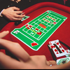
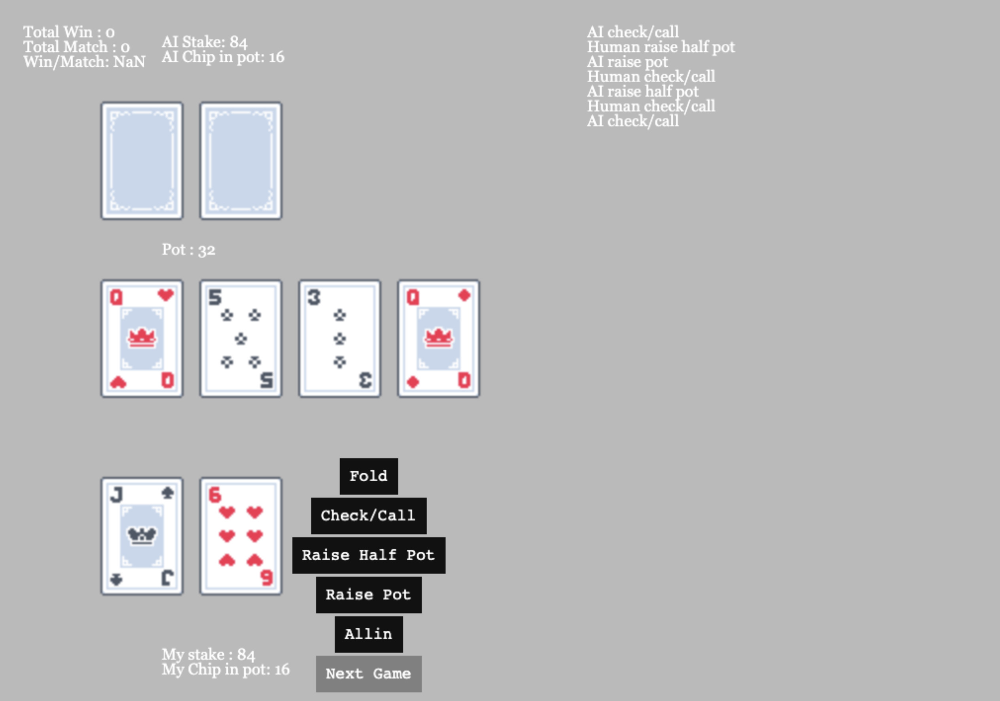

# Alpha NL Holdem



This is an implementation of a self-play non-limit texas holdem ai, using TensorFlow and ray. While heavily inspired by UCAS's work of Alpha Holdem, it's not a offical implementation of Alpha Holdem.

This is a proof of concept project, so rlcard's nl-holdem env was used. It's a 50bb 1v1 env, not the standard 100bb ACPC one, and bet sizes are slightly different than ACPC.

I asked a few pro holdem players to play against this ai for some dozen games. They report that the ai's moves are all logical. They did not observe any significant mistakes.

# Goal
1. Provide a clean codebase for apply self-play model-free RL method in Holdem-like games.
2. Try to reproduce the result of the AlphaHoldem.
3. Provide All data, including checkpoints, training methods, evaluation metrics and more.

# Getting Started
This project assumes you have the following:
1. Conda environment ([Anaconda](https://www.anaconda.com/) /[Miniconda](https://docs.conda.io/en/latest/miniconda.html)) 
2. Python 3.7+ 

Install dependences:

```shell script
pip3 install -r requirements.txt
```

# Usage

## Play against Neural Net

First go to gui directory, and run the python script:

```shell script
cd gui
python3 play_against_ai_in_ui.py
```

And go to [http://localhost:8000/](http://localhost:8000/) to play against the NeuralNet.

Yes, it's a small tool I write to play against AI, Yes, it looks bad. But it works.

By default you are playing against an NN opponent which has been trained for about a week.



## Trainning

### Training 101

To start the training, you have to first change the config in ```confs/nl_holdem.py```

By default it would require 1 GPU and 89 cpu to run this program.

Modify the line in the config file:

```python
    'num_workers': 89,
```

change it to the cpu core that your machine have. However you still need at least one gpu to run this the training.
 
And then use command:
```shell script
python3 train_league.py --conf confs/nl_holdem.py --sp 0.0 --upwin 1.0 --gap=500 --league_tracker_n 1000
```

Winrate against history agents will be displayed in the stdout log.


### Restore training

If the training process is somehow killed or you want to start from the weights you downloaded, First put the downloaded ```league``` folder in this project's root. Then use command :

```shell script
python3 train_league.py --conf confs/nl_holdem.py --sp 0.0 --upwin 1.0 --gap=500 --league_tracker_n 1000 --restore league/history_agents
```

It would auto load all training weights and continue training.

# Released data

1. Weights of all checkpoints in the process of a week of training, ~ 1 billion of selfplay games:
    https://drive.google.com/file/d/1G_GwTaVe4syCwW43DauwSQi6FqjRS3nj/view?usp=sharing
2. Evaluation metrics and part of results: see ```nl-evaluation.ipynb```
    

# Known Issues
1. Rlcard environment sucks, 50bb pot, wrong pot sizes, wrong action order after flop, I don't know where to start. But it's the only environment I konw out there suitable for this task.
2. Even after ~ 1 billion self-play, over 1000 checkpoints, the model seems still not converge, still improving itself, I really don't know when it will converge. It could be some bug, not sure.
